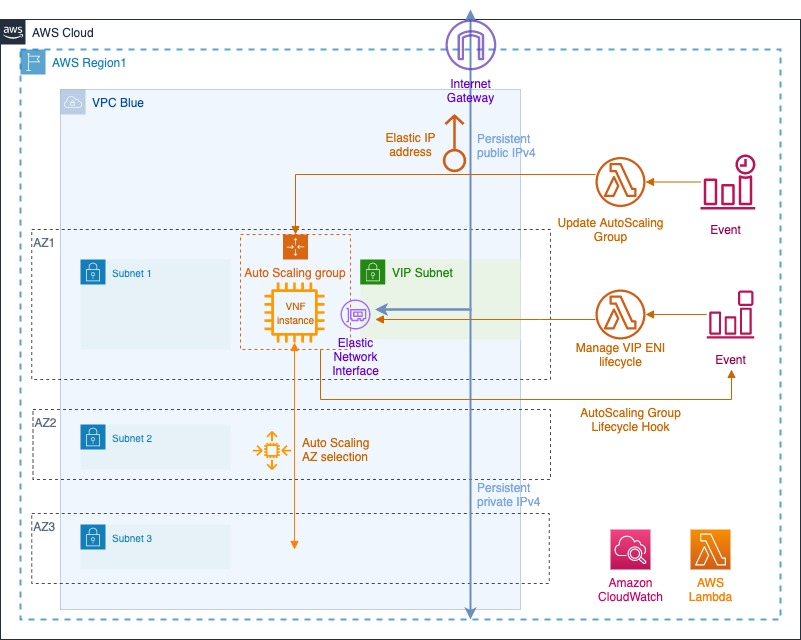
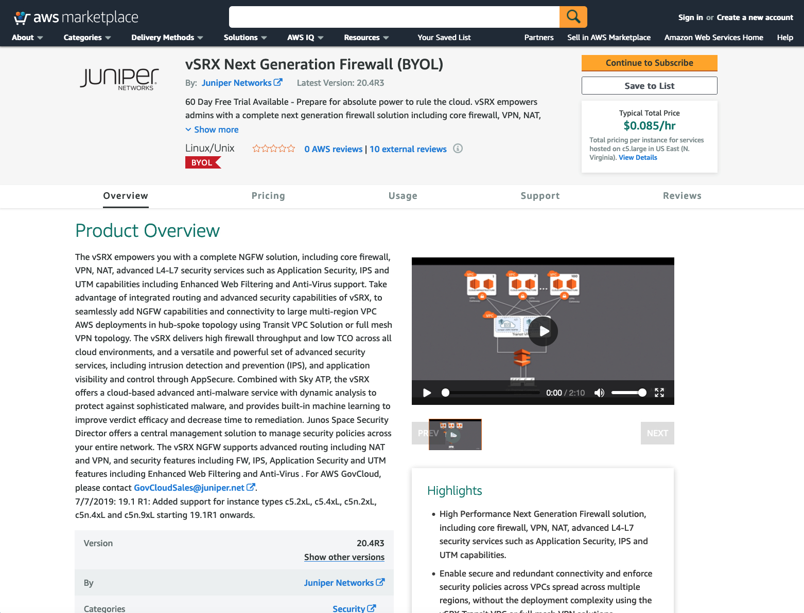
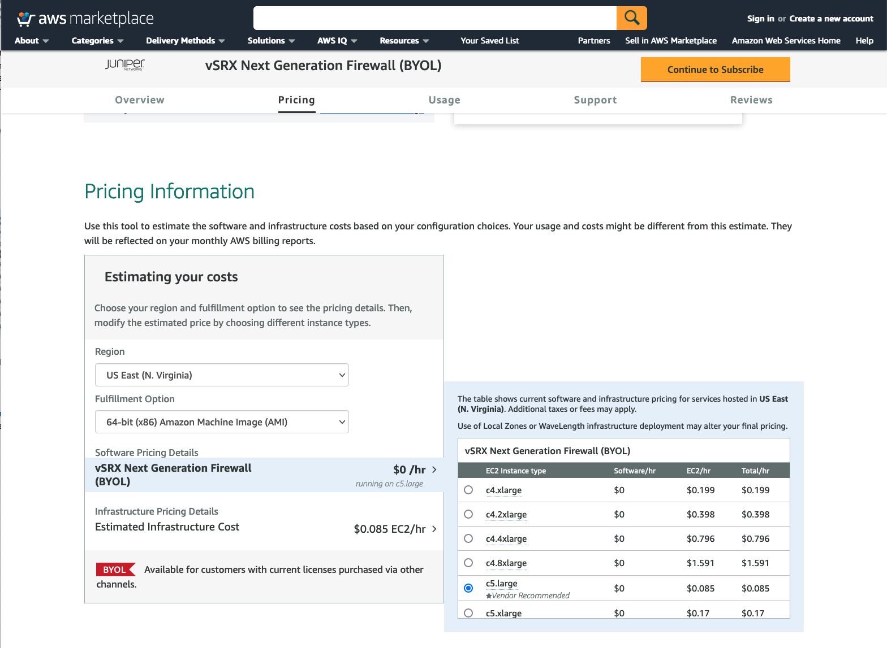
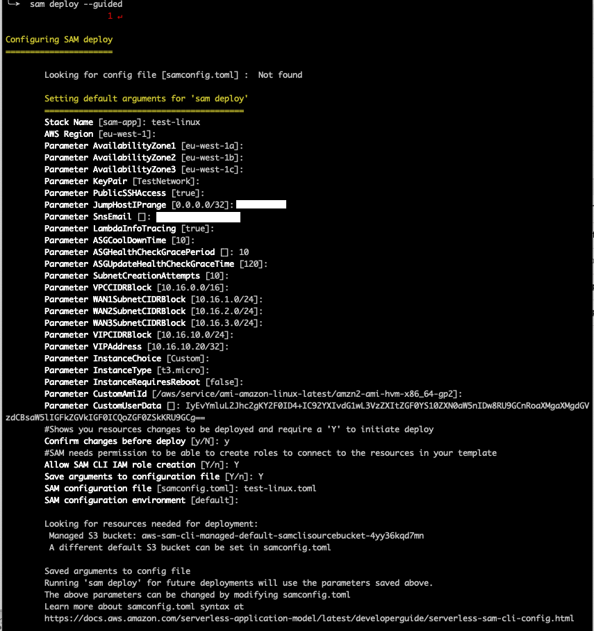
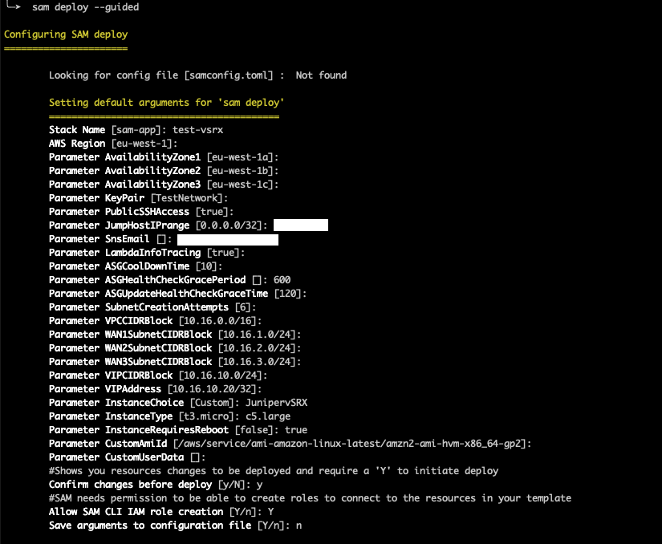
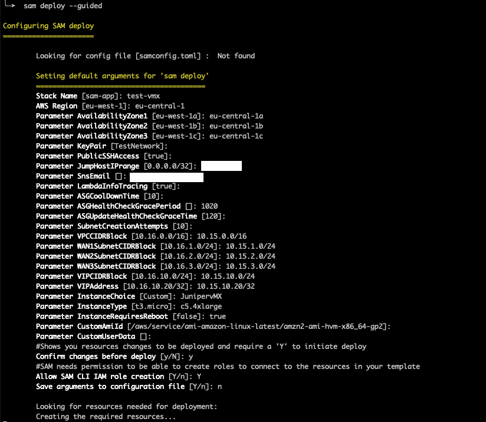

# Auto-healing persistent Virtual Network Functions on AWS

[Read the post]() on this application in the AWS Industry Telecommunications blog.

## Summary

When virtualizing Network Functions (NFs), a usual concern is how to provide a framework that ensures persistence and auto-healing. NFs are usually deployed in combination with remote clients, peers or simply within a management ecosystem, and it is crucial that they persistently preserve allocated IPv4 addresses, both in private and public contexts, independently from where they are hosted. These NFs also need to be able to auto-recover from failures upon uniform criteria and with the same configuration they had before.

This is a sample event-driven implementation that leverages AWS native resources to achieve both persistence and auto-healing for an NF. For this NF, you can select a custom Amazon EC2 instance and image, but also well-known samples from the Telco industry, such as [Cisco Systems CSR1000v](https://aws.amazon.com/marketplace/pp/prodview-tinibseuanup2?ref_=aws-mp-console-subscription-detail), [Juniper Networks virtual SRX (vSRX)](https://aws.amazon.com/marketplace/pp/B01LYWCGDX?ref_=aws-mp-console-subscription-detail) or [Juniper Networks virtual MX (vMX)](https://aws.amazon.com/marketplace/pp/B01LXLJMG7?ref_=aws-mp-console-subscription-detail) routers. 

The following diagram represents this sample topology that includes the following:
* A *Launch Template* for the Virtual NF (VNF) EC2 instance with one interface, bootstrap configuration as UserData and other basic settings.
* An *Amazon EC2 Auto Scaling Group (ASG)* that uses that Launch Template, and can be enabled across multiple Availability Zones (AZs)
* Auto Scaling *Lifecycle Hooks* that can be used to capture instance termination and launch stages
* An *AWS Lambda function* that manages the lifecycle of a second *Elastic Network Interface (ENI)*, that provides IPv4 address persistence. This includes subnet creation, interface creation with a preassigned persistent private IPv4 address and attachment and allocation for the launch events, and the reverse sequence for the termination events. 
* An *Amazon CloudWatch* or *EventBridge Event* that uses such Lifecycle Hooks as triggers and that AWS Lambda function as destination to manage the lifecycle of an ENI
* Another pair of *Amazon CloudWatch* or *EventBridge Event* and *AWS Lambda function* to address the very first warmup period for the EC2 Auto Scaling Group after its definition, and updates its desired capacity to 1 to trigger the process
* An *Amazon Simple Notification Service (SNS)* topic for event notification

Additional complimentary services, such as *AWS Identity and Access Management (IAM)* Roles and Policies, and *Amazon Virtual Private Cloud (VPC)* resources, like Subnets, Route Tables, Endpoints and Elastic IP Address (EIP) are created as needed to support the architecture.

## Deployment Prerequisites

This sample code is handled through [AWS Serverless Application Model](https://docs.aws.amazon.com/serverless-application-model/index.html) (SAM), which is an open-source framework that enables you to build serverless applications on AWS and creates resources through a main AWS CloudFormation template in [YAML](https://yaml.org/), named [nfv_infrastructure_and_vnf.yml](nfv_infrastructure_and_vnf.yml) in this repository.

By using AWS SAM, many internal operations are automatically handled and become transparent for the user, such as the creation of an S3 bucket or the upload of the AWS Lambda functions to this bucket, so that they can be used by the architecture. 

Before deploying the stack with AWS SAM, the following prerequisites must be fulfilled:

### 1. AWS account credentials and permissions

Obtain access to an AWS account and IAM credentials that provide the necessary permissions to create resources mentioned in the [Summary](#summary) section. This example assumes *AdministratorAccess* credentials and corresponding [environment variables](https://docs.aws.amazon.com/serverless-application-model/latest/developerguide/serverless-getting-started-set-up-credentials.html) set in the CLI, which will include AWS Access Key ID and AWS Secret Access Key.

### 2. AWS Serverless Application Model (SAM) CLI installation

Install the [AWS SAM CLI](https://docs.aws.amazon.com/serverless-application-model/latest/developerguide/serverless-sam-cli-install.html) in your client computer. This installation is available for [Linux](https://docs.aws.amazon.com/serverless-application-model/latest/developerguide/serverless-sam-cli-install-linux.html), [Windows](https://docs.aws.amazon.com/serverless-application-model/latest/developerguide/serverless-sam-cli-install-windows.html) and [macOS](https://docs.aws.amazon.com/serverless-application-model/latest/developerguide/serverless-sam-cli-install-mac.html), and includes the enforcement of the AWS account environment installation, an optional Docker installation and the SAM CLI package installation itself.  

### 3. Resource planning 

Create an [Amazon EC2 KeyPair](https://docs.aws.amazon.com/AWSEC2/latest/UserGuide/ec2-key-pairs.html) within the AWS account, that may be used for secure instance access via SSH. 

Decide if direct SSH access to the VNF is required (*AWS Systems Manager* access is enabled through the corresponding IAM role and profile, but the VNF would need to support that), and if enabled, identify the IPv4 CIDR range that may cover the source address segment that may be used for direct SSH access.

Evaluate values to be used for the parameters as explained at [Guided Deployment](#guided-deployment) and decide which type of VNF you want to use, which will determine the instance image. This can be a custom *Amazon Machine Image (AMI)* or some other images preloaded in this sample from [Cisco Systems CSR1000v](https://aws.amazon.com/marketplace/pp/prodview-tinibseuanup2?ref_=aws-mp-console-subscription-detail), [Juniper Networks virtual SRX (vSRX)](https://aws.amazon.com/marketplace/pp/B01LYWCGDX?ref_=aws-mp-console-subscription-detail) or [Juniper Networks virtual MX (vMX)](https://aws.amazon.com/marketplace/pp/B01LXLJMG7?ref_=aws-mp-console-subscription-detail) routers as the VNFs.

### 4. AWS Marketplace subscription

If you do not want to use your own custom *Amazon Machine Image (AMI)* or default latest Amazon2 Linux AMI, you can select preloaded [Cisco Systems CSR1000v](https://aws.amazon.com/marketplace/pp/prodview-tinibseuanup2?ref_=aws-mp-console-subscription-detail), [Juniper Networks virtual SRX (vSRX)](https://aws.amazon.com/marketplace/pp/B01LYWCGDX?ref_=aws-mp-console-subscription-detail) or [Juniper Networks virtual MX (vMX)](https://aws.amazon.com/marketplace/pp/B01LXLJMG7?ref_=aws-mp-console-subscription-detail) routers as the VNFs. AMIs for these sample vendors are preloaded and it just required to accept and subscribe to the corresponding software package in the [AWS Marketplace](https://aws.amazon.com/marketplace).

The [AWS Marketplace](https://aws.amazon.com/marketplace) is an online store where Independent Software Vendors (ISVs) and consulting partners can sell their solutions that run on AWS. This provides a new sales channels for AWS users to find, buy and immediately start using software or services from 3rd parties, but implemented on AWS. 

For this sample code, the following AWS Marketplace subscriptions are required in either case:
  * **Cisco CSR1000v BYOL**: https://aws.amazon.com/marketplace/pp/prodview-tinibseuanup2?ref_=aws-mp-console-subscription-detail
  * **Juniper vSRX BYOL**: https://aws.amazon.com/marketplace/pp/B01LYWCGDX?ref_=aws-mp-console-subscription-detail
  * **Juniper vMX BYOL**: https://aws.amazon.com/marketplace/pp/B01LXLJMG7?ref_=aws-mp-console-subscription-detail
  
First, click one of the previous links for the corresponding VNF and you will land in the Product Overview page at the AWS Marketplace, such as:

Further down in the same page, you can see the recommended image size and estimated costs. This software package also allows you to select different instance type sizes and you can see here the pricing estimations for each one of them. Note that these preloaded products are using using Bring-Your-Own-License (BYOL) versions for these vendors, so the pricing estimations just include the compute costs and do not consider the specific licenses, as it is expected that the user will bring and enforce each one in each system separately.

Just click on ‘Continue to Subscribe’ and follow the next steps. Once accepted and if the subscription has been confirmed, the respective instance type can be used and selected for the stack. 

## Guided Deployment

This code sample uses AWS SAM to orchestrate the stack deployment, based on [nfv_infrastructure_and_vnf.yml](nfv_infrastructure_and_vnf.yml) as the main *AWS CloudFormation* template. This template creates all AWS resources and you will be billed for them in the specific AWS account.

Once all prerequesites described at [Deployment Prerequisites](#deployment-prerequisites) have been fulfilled, you are ready to deploy the solution following these steps:

  1. Run ``sam init`` then choose ``Custom Template Location`` and paste the repository URL, which will clone this repository locally.
  2. Build the AWS SAM application by running in your CLI ``sam build -t nfv_infrastructure_and_vnf.yml``
  3. Deploy the AWS SAM application. Initially, you can opt for a guided deployment with ``sam deploy –guided``. Several parameters are required for the stack instantiation and I recomend to start with default hinted values for each parameter and then fine tune, depending on your use case:
      * **``AvailabilityZones``**: Availability Zones where the VNF can be instantiated as decided by the EC2 Auto Scaling group. You can repeat an AZ if you want to increase preference weight for a given AZ selection.
      * **``KeyPair``**: An Amazon EC2 Keypair to directly access the device per SSH, as per prerequisites. This keypair applies to each instance type, and is associated to **ec2-user** username per default in Amazon Linux2, Cisco CSR1000v and Juniper vSRX, and to **jnpr** user in Juniper vMX.
       * **``PublicSSHAccess``**: Configuration option (``true`` or ``false``) to decide if external SSH access from public IPv4 addresses is allowed or not. If allowed, the source range is determined under **``JumpHostIPrange``**. If not allowed, only AWS Systems Manager Session Manager access will be availble, where applicable.
       * **``JumpHostIPrange``**: Source public IPv4 Address range allowed to connect to the instance management port per SSH. Only applicable if **``PublicSSHAccess``** is ``true``.
       * **``SnsEmail``**: The email address that receives SNS notifications
       * **``LambdaInfoTracing``**: Configuration option (``true`` or ``false``) to include log INFO level details in AWS Lambda CloudWatch logs or not
       * **``ASGCoolDownTime``**: Time (in seconds) to guard between consecutive launch and terminate actions in the EC2 Auto Scaling Group. As this also depends on the bootup time of each instance, it is recommended to start with the default hinted value (``10``) as the bare minimum. The default value in AWS for the EC2 AutoScaling CooolDown time is ``300`` seconds.
       * **``ASGHealthCheckGracePeriod``**: Grace time (in seconds) to wait before checking the instance health status after launching the EC2 Auto Scaling Group. As this also depends on the bootup time of each instance, it is recommended to start with the following recommended tested values as the bare minimum, but also to be conservative to allow for the proper VNF bootstrap time beyond the minimum, as this may change and depend on your specific VNF version (the generic default value in AWS is ``300`` seconds). The main difference in these time values is driven by the instance size and by the additional reboot required by some VNFs after the interface attachment, and in theses cases health checks would need to be avoided during the subsequent reboot.
         * For Amazon Linux2: ``10``
         * For ``CiscoCSR1000v`` VNF:``10``
         * For ``JunipervSRX`` VNF: ``600``
         * For ``JunipervMX`` VNF: ``1020``
       * **``ASGUpdateHealthCheckGraceTime``**: Grace time (in seconds) after creation of ASG Lifehooks and before launching first instance. It is recommended to start with the default hinted value (``120``) as a minimum and you can adjust it afterwards.
       * **``SubnetCreationAttempts``**: Number of attempts to create the VIP subnet within same Lifecycle Launch stage. As this also depends on the bootup time of each instance, it is recommended to start with the default hinted value (``6``) as a minimum and you can adjust it afterwards.
       * **``VPCCIDRBlock``**: The overall CIDR Block for the VPC 
       * **``WANSubnetCIDRBlocks``**: specific CIDR Blocks for WAN Subnets in each AZ, they need to be included within the overall VPC CIDR block
       * **``VIPCIDRBlock``**: The specific CIDR Block for the subnet segment to attach and detach. This moves along with the instance and therefore provides persistent IPv4 reachability to the VNF.
       * **``VIPAddress``**: within the **``VIPCIDRBlock``** range, the specific private IPv4 address (/32) that is persistently allocated to the VNF ENI and mapped to the public EIP. This private IPv4 provides consistent reachability to the VNF within internal private networks
       * **``InstanceChoice``**: you can choose between preselected AMIs with ``CiscoCSR1000v``, ``JunipervSRX`` or ``JunipervMX``, or choose a ``Custom`` image that can be specified as a **``CustomAIMId``** within AWS systems Manager Parameter Store (which defaults to Amazon Linux2). Note that this is a string parameter value and you need to keep this specific syntax when entering this in a SAM deployment.
       * **``InstanceType``**: EC2 instance type for the VNF. In this code sample, you can enter ``t3.micro`` (overall default), ``c5.large``, ``c5.2xlarge`` or ``m5.large``. Each vendor provides recommended default values at the AWS Marketplace: for ``CiscoCSR1000v`` BYOL and ``JunipervSRX`` BYOL it is ``c5.large``, and for ``JunipervMX`` BYOL it is ``c5.4xlarge``. Note that this is a string parameter value and you need to keep this specific syntax when entering this in a SAM deployment.
       * **``InstanceRequiresReboot``**: Configuration option (``true`` or ``false``) that enforces a VNF reboot after attaching the VIP Elastic Network Interface (ENI). This depends on the specific VNF behavior, and if it supports dynamically attaching an ENI without requiring restart or not. ``JunipervSRX`` and ``JunipervMX`` have been tested requiring a restart after dynamic interface attachment (``true``), others like ``CiscoCSR1000v`` or a plain Amazon Linux2 instance can dynamically incorporate additional ENIs without requiring a reboot (``false``))
       * **``CustomUserData``**: Optional free text field to enter User Data whenever a custom instance is selected (only needed if the VNF is neither ``CiscoCSR1000v`` , nor  ``JunipervSRX``, nor ``JunipervMX``, because basic User Data is provided in this package for those cases).

You can see some sample deployment choices under [Sample Deployment Choices](#sample-deployment-choices). The SAM deployment will ask you to confirm the stack creation with those parameters and it gives you the option to save these entered parameters in a local ``.toml`` file that can be reused later (see [Advanced Configuration Deployment](#advanced-configuration-deployment)). The execution takes approximately 10 minutes to complete.

Because an SNS topic is created, an e-mail will be sent to the **``SnsEmail``** Parameter value to confirm the SNS subscription and to notify subsequent events. You would need to accept an initial notification to that e-mail upon stack creation, in order to be able to receive notifications for further events.

During the stack creation time, you will observe that the VNF instance creation is delayed for the amount of time specified under **``ASGHealthCheckGracePeriod``**, so this will affect your overall initial solution standup time.

Once you have deployed that stack first, it is no longer needed to build the AWS SAM application again, unless you have changed the main AWS CloudFormation template. In this case, you do not need to run ``sam init`` or ``sam build -t nfv_infrastructure_and_vnf.yml`` again in later executions, and it suffices by going through the guided deployment again ``sam deploy –guided`` or ``sam deploy –config-file <sample.toml>``as described in [Advanced Configuration Deployment](#advanced-configuration-deployment)

## Sample Deployment Choices

### Sample SAM guided Amazon Linux2 deployment

This is a screenshot from a sample SAM deployment for an Amazon Linux2 instance. Note how the default ``eu-west-1`` region has been assumed for the deployment, together with default IPv4 address setings. 

Amazon Linux2 is chosen by default, because the ``InstanceChoice`` parameter remains ``Custom`` and the ``CustomAmiId`` field has not been modified to point to any specific AWS Systems Manager Parameter Store where a specific AMI Id would be saved, and it points to the Amazon Linux2 path per default.

Note how specific bootstrap User Data is base64-encoded and entered within the ``CustomUserData`` field. For further details about this, please check https://docs.aws.amazon.com/AWSEC2/latest/UserGuide/instancedata-add-user-data.html  

### Sample SAM guided Cisco CSR1000v deployment

This is another sample SAM deployment screenshot for a Cisco CSR1000v instance. In this particular case, the specific deployment is carried out in the ``us-east-1`` AWS Region, and it includes 3 of its Availability Zones (AZs). You can repeat the same Availability Zone value across the 3 parameters, if you want to reduce their eligibility, or even enter the same one for the 3 parameters, if you want to only use a single AZ.

Specific CIDR ranges for the complete VPC and all subnets are entered, together with the VIP value for the persistent private IPv4 address.

The ``InstanceChoice`` value needs to be explicitly configured as ``CiscoCSR1000v`` and then the ``CustomAmiId`` and ``CustomeUserData`` parameter values do not apply. ``InstanceType`` is ``c5.large`` as per default vendor recommendation.

### Sample SAM guided Juniper vSRX deployment

This is another sample SAM deployment screenshot for a Juniper vSRX instance. Note how the default ``eu-west-1`` region has been assumed for the deployment, together with default IPv4 address setings. 

The ``InstanceChoice`` value needs to be explicitly set to ``JunipervSRX`` and then the ``CustomAmiId`` and ``CustomeUserData`` parameter values do not apply.  ``InstanceType`` is ``c5.large`` as per default vendor recommendation.

### Sample SAM guided Juniper vMX deployment

This is another sample SAM deployment screenshot for a Juniper vMX instance. In this particular case, the workload is deployed in the ``eu-central-1`` AWS Region, and it includes 3 of its Availability Zones (AZs).

Specific CIDR ranges for the complete VPC and all subnets are entered, together with the VIP value for the persistent private IPv4 address.

The ``InstanceChoice`` value needs to be explicitly``JunipervMX`` and then the ``CustomAmiId`` and ``CustomeUserData`` parameter values do not apply.  ``InstanceType`` is ``c5.4xlarge`` as per default vendor recommendation.

## Advanced Configuration Deployment

The AWS SAM CLI also supports a project-level [configuration file](https://docs.aws.amazon.com/serverless-application-model/latest/developerguide/serverless-sam-cli-config.html) that stores default parameters for its commands. This configuration file is in the [TOML](https://toml.io/en/) file format and you can achieve a more programmatic deployment approach using it with AWS SAM.

If you start with the ``sam deploy -guided`` command, as described [Guided Deployment](#guided-deployment), you can enable the option to write the subset of parameters to your configuration file, named ``samconfig.toml`` per default and stored locally in the same project's root directory path. During subsequent deployment executions, you can directly launch this sample from that configuration file using the ``-config-file`` parameter, instead of going through the menu for the parameter selection. You can manually edit this file to change the Parameter values and handle this deployment more programmatically.

The steps to deploy the solution with configuration file are the following:

  1. Navigate to the cloned repository directory, or run ``sam init`` then choose ``Custom Template Location`` and paste the repository URL.
  2. Build the AWS SAM application by running in your CLI ``sam build -t nfv_infrastructure_and_vnf.yml``
  3. Deploy the AWS SAM application. Deploy the application with ``sam deploy –config-file <sample.toml>``, where ``<sample.toml>>`` is the parameter configuration file.

Once the SAM application has been built, if you want to redeploy the stack, it is just enough by repeating step number 3.

The [sample_configs](sample_configs/) directory includes sample ``.toml`` configuration files for the same representative examples described before in [Sample Deployment Choices](#sample-deployment-choices). These example files have a wide open source IPv4 range (``0.0.0.0/0``), which would not be recommended for production deployments, the S3 bucket prefix for SAM CLI has been replaced with ``<your-s3-bucket-for-SAM-cli>`` and a fake e-mail address (``foo@foo.bar``) has been set for SNS notifications, so replace these parameter values with yours before deployment.  

## Cleanup

To delete the complete scenario, I recommend to directly delete the AWS CloudFormation stack created by the AWS SAM application. 

This deletion attempt will take several minutes and will not be an empty cleanup, because the secondary persistent ENI is created by the Lambda function and becomes part of the environment, but was not created first by the SAM application stack. The AWS CloudFormation stack deletion will not be first completely successful and will remain in DELETE_FAILED status, because this resource was not created by AWS CloudFormation before. 

Next, I recommend to follow the steps to [force delete](https://aws.amazon.com/premiumsupport/knowledge-center/cloudformation-stack-delete-failed/) the AWS CloudFormation stack again, skipping remnant resources in the VPC, and then remove these remnant VPC and Route Table manually afterwards.

# Security

See [CONTRIBUTING](CONTRIBUTING.md#security-issue-notifications) for more information.

# License

This library is licensed under the MIT-0 License. See the LICENSE file.

